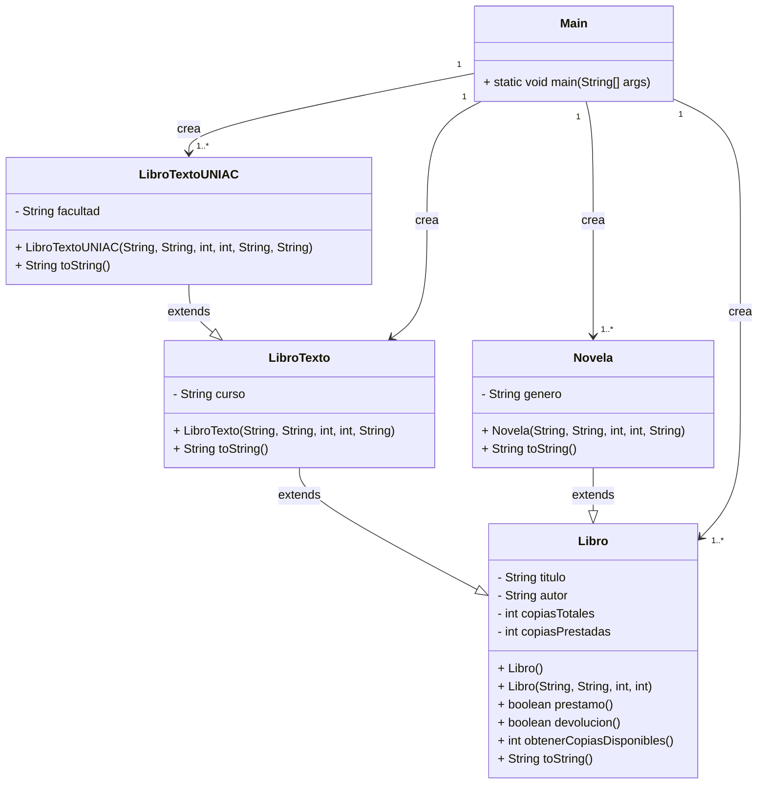

# Parcial 1 - Programacion II

## Descripcion

Aplicacion Java para gestionar libros en una biblioteca simple.

- Implementa Programacion Orientada a Objetos (POO) y herencia.
- Maneja libros generales y libros especializados (texto, universitarios, novelas).
- Incluye operaciones de prestamo, devolucion y calculo de copias disponibles.
- Muestra informacion en consola usando toString() en cada clase.

## Estructura de carpetas

- `src/main/java/BibliotecaUniajc`

## Clases

### Libro

- Atributos: `titulo`, `autor`, `copiasTotales`, `copiasPrestadas`.
- Constructores: vacio y con parametros.
- Metodos:
  - `boolean prestamo()`
  - `boolean devolucion()`
  - `int obtenerCopiasDisponibles()`
  - `String toString()`

### LibroTexto

- Extiende `Libro`.
- Atributo extra: `curso`.
- Sobrescribe `toString()` para incluir `curso`.

### LibroTextoUNIAC

- Extiende `LibroTexto`.
- Atributo extra: `facultad`.
- Sobrescribe `toString()` para incluir `facultad`.

### Novela

- Extiende `Libro`.
- Atributo extra: `genero`.
- Sobrescribe `toString()` para incluir `genero`.

### Main

- Clase principal con `public static void main(String[] args)`.
- Crea instancias de `Libro`, `LibroTexto`, `LibroTextoUNIAC` y `Novela`.
- Imprime las instancias y demuestra la herencia y el comportamiento de los metodos.

## Ejecucion

1. `cd demo`
2. `mvn compile`
3. `java -cp target/classes BibliotecaUniajc.Main`

## Diagrama de clases

- Archivo generado: `diagrama_clases.puml`
- Herencia:
  - `Libro` <- `LibroTexto` <- `LibroTextoUNIAC`
  - `Libro` <- `Novela`
- `Main` instancia todas las clases.

### Mermaid (texto)

